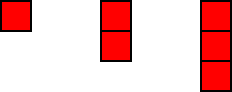
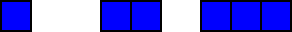
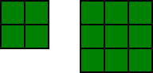
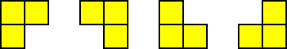
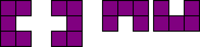
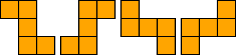
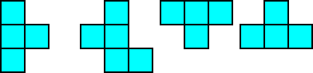
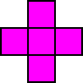
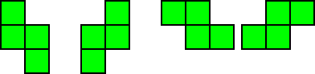

**Игра «Собери блоки»**

*Описание* 

Игра-головоломка наподобие «Тетриса», где надо из фигур собирать строки, которые будут удаляться. Расстановкой блоков занимается игрок, который делает выбор между предложенными случайными блоками.

Игра будет поддерживать следующие режимы:

1. «Бесконечный» \- где игрок просто 	расставляет фигуры без ограничений по 	времени, зарабатывая очки.  
2. «Битва со временем» \- игроку даётся 10 	минут на игру и задачей будет набрать 	максимально возможное количество 	очков.

Игра будет поддерживать 3 уровня сложности:

1. Лёгкий — выбор из 7 случайных фигур  
2. Средний — выбор из 5 случайных фигур  
3. Тяжёлый — выбор из 3 случайных фигур  
4. Кошмарный — одна случайная фигура

*Фигуры*

В игре будет присутствовать 29 фигур:

1. От 1 до 3 клеток, прямая, вертикальная или горизонтальная — 6 фигур

2. Квадраты: 2х2 и 3х3 — 2 фигуры

3. Уголки — 4 фигуры

4. «Подкова» \- 2х3 — 4 фигуры

5. «Зигзаг» \- 3х3 — 4 фигуры

6. «Т-образные» \- 2х3 — 4 фигуры

7. «Крест» \- 1 фигура

8. Классический тетрисный зиг\-заг — 4 фигуры

*Механика игры*

*Игра.* Игровое поле будет состоять их 10х10 клеток. Под полем в случайном порядке будут появляться фигуры (количество зависит от уровня сложности), из которых игроку предстоит выбирать фигуры, которые он будет выставлять на поле. После выбора фигуры и выставления её на поле происходит смена фигур.

*Удаление ряда.* Как только будет заполнен ряд он удаляется, а оставшиеся клетки сдвигаются. Если удаление столбца (ряда) прошло с 1 по 5, то сдвиг происходит слева направо (сверху вниз) от удалённого столбца (ряда). Если с 6 по 10, то справа налево (снизу вверх).

*Подсчёт очков.* При выставлении фигуры в общий счёт игрока добавляется количество очков равных количеству «блоков» в фигуре. За удаление одного ряда добавляется 10 очков, за одновременное удаление двух рядов — 20 очков, за 3 ряда — 50 очков, за 4 ряда — 100 очков. За пустое поле после выставления фигуры и удаления рядов — 300 очков.
